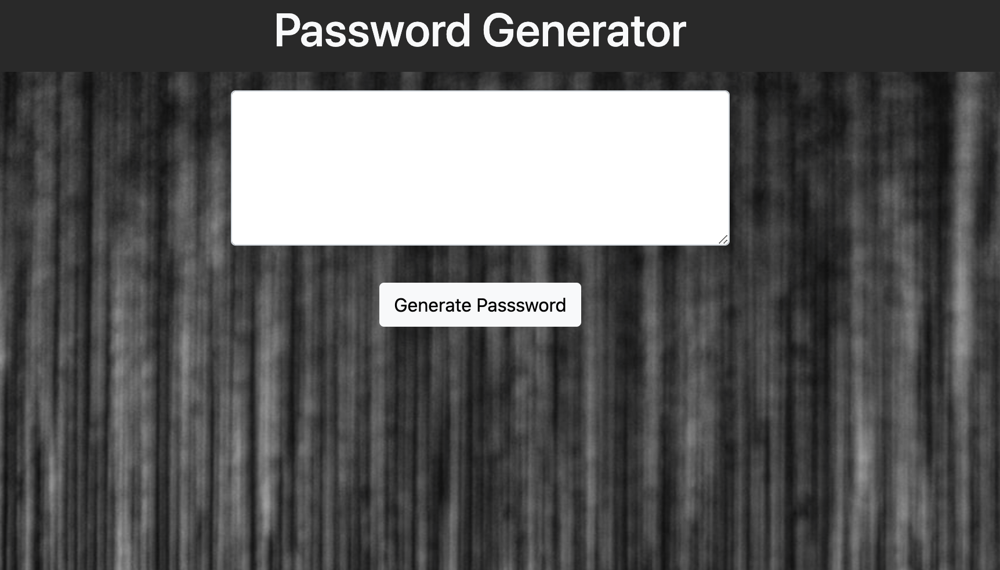

# Password Generator

---

A password generator that creates a new, secure password based on a series of prompts. The prompts consist of length of the password (between 8 and 128 characters) & character types to include (uppercase, lowercase, numeric, and/or special characters). At least one character type must be selected. After the prompts the password is generated.

---

## Requirements

GIVEN I need a new, secure password \
WHEN I click the button to generate a password \
THEN I am presented with a series of prompts for password criteria \
WHEN prompted for password criteria \
THEN I select which criteria to include in the password \
WHEN prompted for the length of the password \
THEN I choose a length of at least 8 characters and no more than 128 characters \
WHEN prompted for character types to include in the password \
THEN I choose lowercase, uppercase, numeric, and/or special characters \
WHEN I answer each prompt \
THEN my input should be validated and at least one character type should be selected \
WHEN all prompts are answered \
THEN a password is generated that matches the selected criteria \
WHEN the password is generated \
THEN the password is either displayed in an alert or written to the page

---

## Links

* [Password Generator](https://jondnv.github.io/PasswordGenerator/)
* [Github Repository](https://github.com/JonDnv/PasswordGenerator)
  
---

## Mock Up

The following image shows the finished site:

---

## Contributing

* Bootstrap
* Font Awesome
* Stack Overflow
* w3 Scbools
* Unsplash

---

## Change History

 1. Created Shell index.html site & README
 2. Created If/Else Statements for Variable Selection
 3. Completed Password Generation Functions.
 4. Completed HTML body for index.html
 5. Set Function to Output to HTML box in index.html 